# Mascot Pose Library (reference: "Vui Vẻ"-style host)

Reference pose set extracted from a Vui Vẻ-style Vietnamese explainer. Used as the **emotional + role range target** for the `Why It Works` mascot (WIT). It is a casting sheet, not art to copy 1:1.

## How an AI should use this file

1. Read the spoken line / beat for the scene.
2. Decide the **emotion** the narrator is carrying on that line (curious, smug, shocked, tired…).
3. Use the **Quick index** to jump to candidate poses, then read each pose's **Use when** to pick the best fit.
4. Prefer **show-as-you-say**: change the pose on the beat where the emotion changes (per the channel rule "illustrate per sentence, not per section").
5. Match framing: `closeup` poses = focus/punchline beats; full-body/`presenting` poses = intros and example setups; `prop/role` poses = when the line names that role or object.

Each entry: `` + **Emotion**, **Body / expression**, **Use when**.

> File location: `analysis/vuive poses/`. All image paths below are relative to this file.
> Two poses referenced in earlier notes are NOT on disk (lost during a file add): `holding_phone_pointing_smile`, `smug_smirk_closeup`. Re-add them if needed.

---

## Quick index (emotion → pose)

- **Explaining / making a point:** `lecturing_finger_raised_eyes_closed`, `presenting_open_palm_talking`, `eyes_closed_talking_open_palm`, `pointing_up_curious_open_mouth`, `talking_hand_at_chin_eyes_closed`, `proud_explaining_hand_on_chest_hand_on_hip`, `presenting_screen_announcing_open_mouth`, `pointing_at_globe_explaining`
- **Happy / hyped / approving:** `enthusiastic_point_big_smile`, `happy_laughing_presenting_palm`, `happy_laughing_presenting_closeup`, `big_open_mouth_laugh_presenting_closeup`, `cheerful_presenting_open_mouth`, `cheerful_presenting_fullbody`, `delighted_blushing_sparkle_eyes`, `carefree_laughing_eyes_closed`, `excited_giddy_fists_at_face`, `ok_hand_sign_content_relaxed`, `ok_hand_sign_content_closeup`, `peace_sign_calm_open_mouth`
- **Smug / sly / scheming (the "láo cá" range):** `smug_sly_smirk_leaning`, `unimpressed_smirk_closeup`, `smug_raised_eyebrow_smirk`, `sly_scheming_twiddling_fingers`, `smug_laughing_twiddling_fingers`, `smug_open_mouth_twiddling_fingers`, `eyes_closed_laughing_twiddling_fingers`, `villain_scheming_angry_smile`
- **Deadpan / skeptical / pondering:** `deadpan_unimpressed_half_lidded`, `deadpan_bored_scratching_head`, `skeptical_side_eye_doubtful`, `mildly_surprised_hand_at_chin`, `pondering_skeptical_hand_on_chin`, `hand_on_cheek_surprised_curious`, `hand_on_cheek_pondering_eyes_closed`
- **Shock / panic / anger / direct call-out:** `shocked_panicked_at_laptop`, `shocked_reading_phone_wide_eyes`, `shocked_sweating_dismayed`, `panic_hands_on_cheeks_scream`, `furious_shouting_anger_mark`, `angry_shouting_at_laptop`, `manic_gleeful_googly_eyes`, `emphatic_thumbs_up_angry_talking`, `pointing_at_viewer_serious_accusing`
- **Worry / sad / tired / confused:** `worried_hands_clasped_anxious`, `worried_uneasy_wide_eyes`, `embarrassed_scratching_head_sweat`, `cringe_uneasy_drool`, `annoyed_disgusted_open_frown`, `exhausted_dead_inside_eye_bags`, `exhausted_sleepy_at_desktop`, `sleepy_yawning_open_mouth`, `holding_need_a_job_sign_sad`, `lying_down_fainted_dead`, `shrug_both_hands_up_smile`, `shrug_confused_flat_mouth`
- **Props / role costumes (use when the line names the role/object):** `using_laptop_calm_smile`, `sitting_at_desktop_monitor_deadpan`, `sitting_at_desktop_monitor_using_mouse`, `holding_phone_looking_content`, `holding_phone_happy_talking_blush`, `reading_book_round_glasses_studious`, `dealing_cards_at_table_serious`, `boss_suit_sunglasses_sparkle`, `rich_flex_gold_chain_sunglasses`, `gamer_streamer_headset_with_gun`, `doctor_coat_stethoscope_listening`, `swimming_underwater_goggles_cap`, `wearing_gas_mask_apocalypse`

---

## 1. Explaining / narrating

### lecturing_finger_raised_eyes_closed
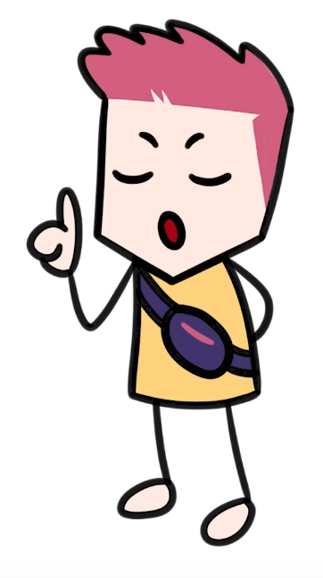
- **Emotion:** confident, mock-authoritative.
- **Body / expression:** index finger raised, eyes closed, small "o" mouth.
- **Use when:** delivering the key point or definition — "Here's the actual reason…", the reframe line, "Rule number one…".

### presenting_open_palm_talking
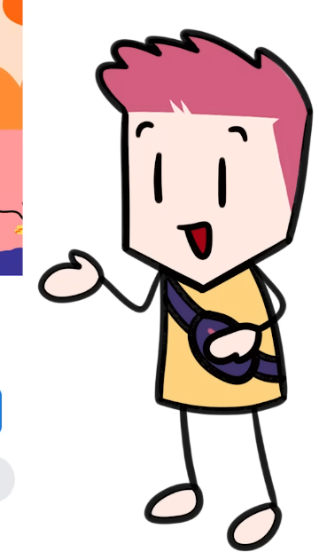
- **Emotion:** friendly, open, mid-explanation.
- **Body / expression:** open palm to the side, eyes open, mouth talking, full body.
- **Use when:** introducing a topic or example — "So let's look at this", "Take subscriptions…".

### eyes_closed_talking_open_palm
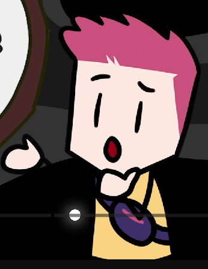
- **Emotion:** calm, matter-of-fact.
- **Body / expression:** eyes closed, "o" mouth, one open palm gesture.
- **Use when:** calm mid-explanation, listing reasons, "and that's basically it".

### pointing_up_curious_open_mouth
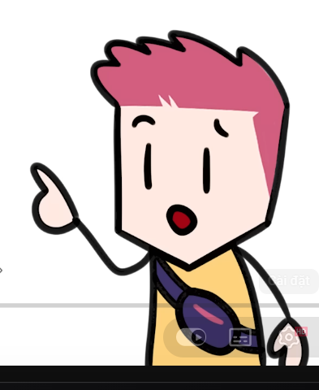
- **Emotion:** curious, "but wait".
- **Body / expression:** finger up, one eyebrow raised, "o" mouth.
- **Use when:** posing the rhetorical question / pivot — "But here's the thing…", "So why does this happen?".

### talking_hand_at_chin_eyes_closed
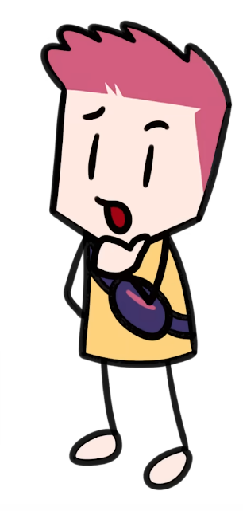
- **Emotion:** thoughtful, qualifying.
- **Body / expression:** eyes closed, "o" mouth, hand near chin, slight lean.
- **Use when:** a nuanced/careful point — "well, sort of", adding a caveat.

### proud_explaining_hand_on_chest_hand_on_hip
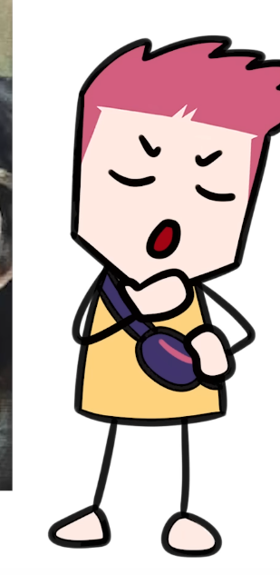
- **Emotion:** proud, mock-grand.
- **Body / expression:** eyes closed, "o" mouth, one hand on chest, one on hip.
- **Use when:** a confident thesis or a mock-self-important declaration — "Allow me to explain modern life".

### presenting_screen_announcing_open_mouth
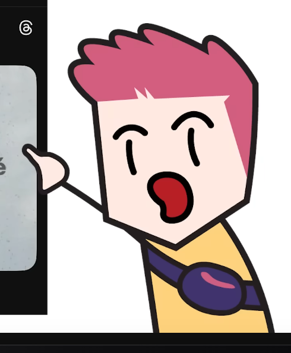
- **Emotion:** announcing, "look at this".
- **Body / expression:** pointing toward a screen/phone on the left, eyes closed, big "o" mouth.
- **Use when:** revealing on-screen evidence — "Look at this post / receipt / app", introducing a screenshot.

### pointing_at_globe_explaining
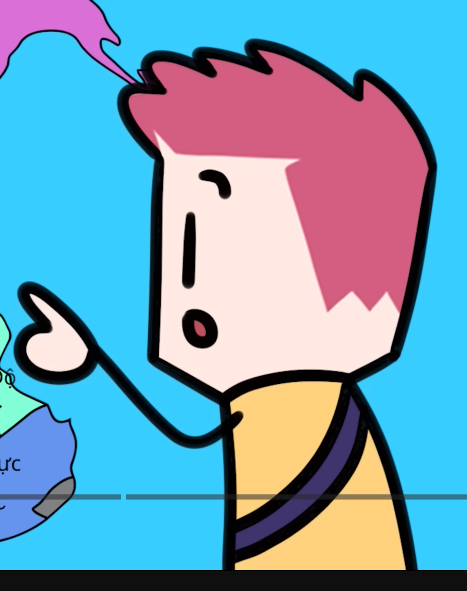
- **Emotion:** explanatory, macro-scale.
- **Body / expression:** pointing at a globe/earth, neutral eyes, "o" mouth.
- **Use when:** big-picture / worldwide framing — "the whole economy", "everyone on the internet".

### eyes_closed_singing_hands_clasped
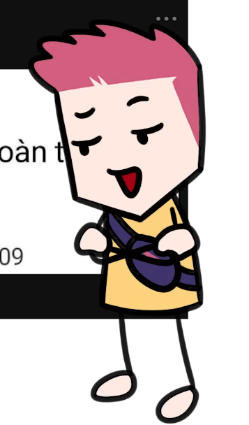
- **Emotion:** sing-song, mock-innocent / cutesy.
- **Body / expression:** eyes closed, "o" mouth, hands clasped near belly.
- **Use when:** sarcastic-sweet narration — "oh how wonderful, another monthly fee", naive voice before the twist.

---

## 2. Happy / hyped / approving

### enthusiastic_point_big_smile
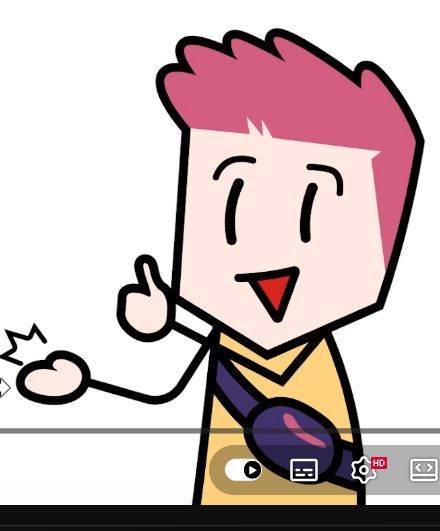
- **Emotion:** excited, emphatic.
- **Body / expression:** raised fist/thumb point, big open smile, motion lines.
- **Use when:** hyping a point — "Exactly!", an upbeat reveal, "and THAT's the trick".

### happy_laughing_presenting_palm
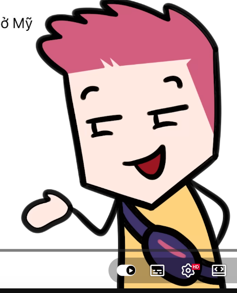
- **Emotion:** cheerful, amused.
- **Body / expression:** eyes closed laugh, open palm presenting.
- **Use when:** a light joke lands; friendly intro to a funny example.

### happy_laughing_presenting_closeup
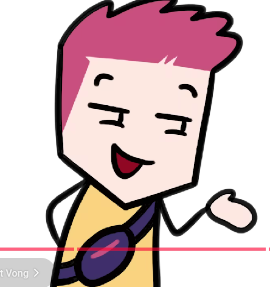
- **Emotion:** amused, warm.
- **Body / expression:** closeup, eyes-closed laugh, presenting palm.
- **Use when:** a focus/punchline beat where the narrator laughs at their own joke.

### big_open_mouth_laugh_presenting_closeup
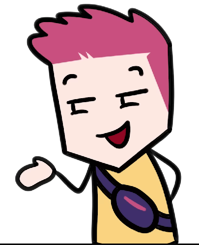
- **Emotion:** big laugh, payoff joy.
- **Body / expression:** closeup, big open-mouth laugh, presenting.
- **Use when:** the biggest punchline / payoff laugh.

### cheerful_presenting_open_mouth
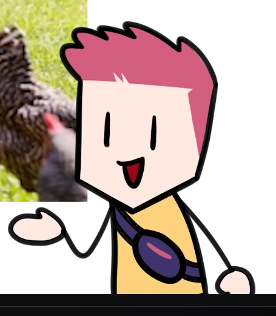
- **Emotion:** enthusiastic, open.
- **Body / expression:** open eyes, open laughing mouth, palm out.
- **Use when:** introducing an example with energy.

### cheerful_presenting_fullbody
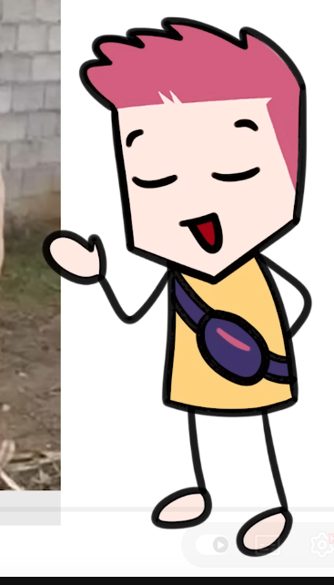
- **Emotion:** friendly, welcoming.
- **Body / expression:** full body, eyes-closed happy, open palm.
- **Use when:** intros and outros — "Welcome back", "and that's the video".

### delighted_blushing_sparkle_eyes
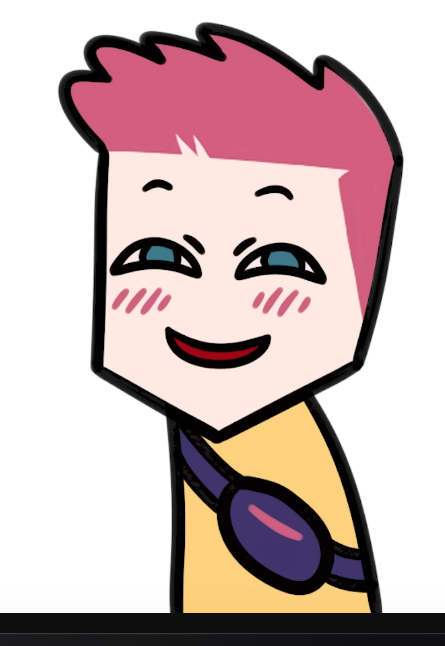
- **Emotion:** delighted, in love with it.
- **Body / expression:** big laugh, blushing cheeks, sparkly teal eyes.
- **Use when:** genuine delight or sarcastic adoration — "Oh, I LOVE a hidden fee".

### carefree_laughing_eyes_closed
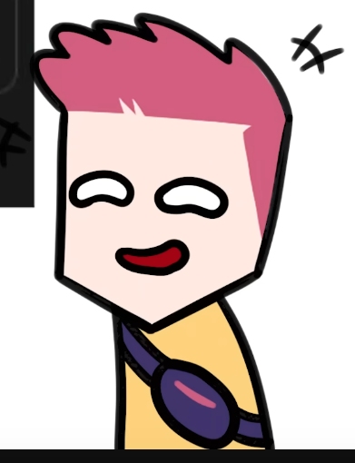
- **Emotion:** carefree, casual laugh.
- **Body / expression:** happy squint eyes, open laugh, head tilt.
- **Use when:** casual laughter — "haha, yeah, classic".

### excited_giddy_fists_at_face
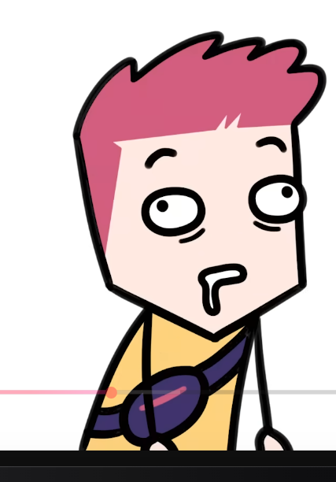
- **Emotion:** giddy, fanboy excitement.
- **Body / expression:** both fists up at face, eyes closed, open mouth.
- **Use when:** mock-anticipation — "ooh I can't wait for the free trial", overexcited beat.

### ok_hand_sign_content_relaxed
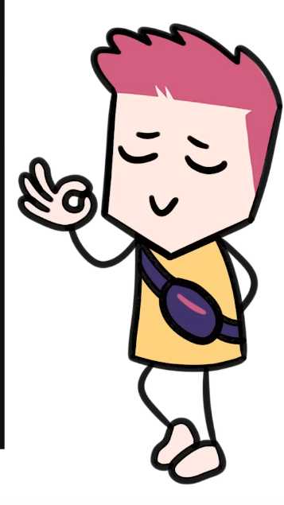
- **Emotion:** content, approving.
- **Body / expression:** OK hand sign, eyes closed, relaxed lean, full body.
- **Use when:** "perfect", "nice", giving something a chill pass.

### ok_hand_sign_content_closeup
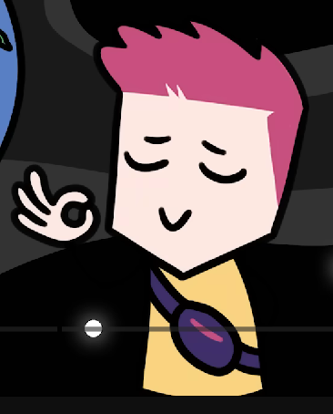
- **Emotion:** content, approving (focus).
- **Body / expression:** OK sign, content face, closeup.
- **Use when:** a closeup approval beat — "and that part? Actually fine".

### peace_sign_calm_open_mouth
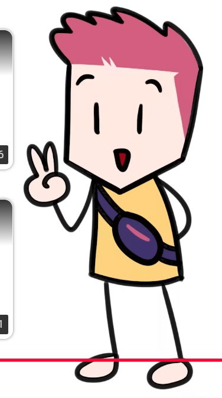
- **Emotion:** calm, casual.
- **Body / expression:** two-finger peace/victory sign, "o" mouth.
- **Use when:** counting ("two things…"), a chill sign-off, "peace".

---

## 3. Smug / sly / scheming

### smug_sly_smirk_leaning
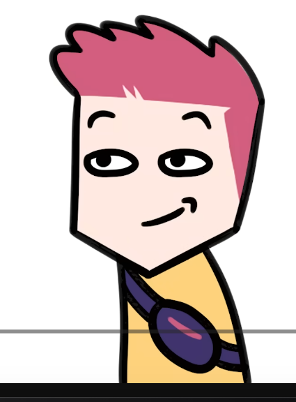
- **Emotion:** knowing, smug.
- **Body / expression:** half-lidded eyes, sly smirk, leaning.
- **Use when:** "you already know where this is going", setup before a reveal.

### unimpressed_smirk_closeup
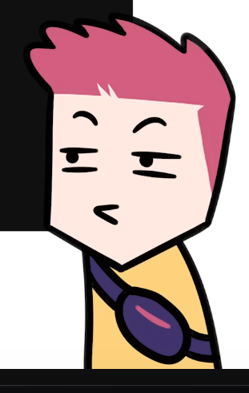
- **Emotion:** unconvinced, dry.
- **Body / expression:** closeup, half-lidded eyes, faint smirk/neutral mouth.
- **Use when:** "sure, buddy", reacting to a dubious claim.

### smug_raised_eyebrow_smirk
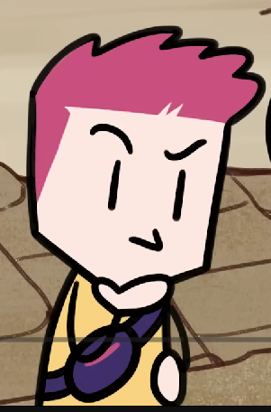
- **Emotion:** skeptical-smug.
- **Body / expression:** one eyebrow raised, smirk, hand near chin.
- **Use when:** "oh, really?", calling out a too-good-to-be-true claim.

### sly_scheming_twiddling_fingers
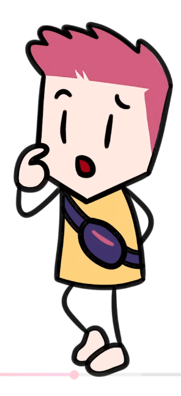
- **Emotion:** scheming, mischievous.
- **Body / expression:** eyes closed, open laugh, fingers twiddling together.
- **Use when:** narrating a trick from the schemer's POV — "here's their clever little plan".

### smug_laughing_twiddling_fingers
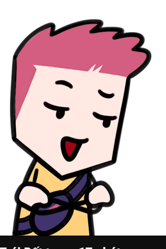
- **Emotion:** gloating, villain-lite.
- **Body / expression:** smug laugh, twiddling fingers, closeup.
- **Use when:** the company/algorithm "wins" — gloating over the catch.

### smug_open_mouth_twiddling_fingers
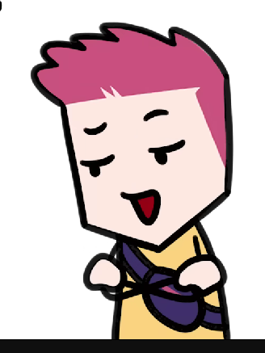
- **Emotion:** smug, scheming.
- **Body / expression:** half-lidded smug eyes, open mouth, twiddling fingers.
- **Use when:** mid-scheme gloat — "and you won't even notice".

### eyes_closed_laughing_twiddling_fingers
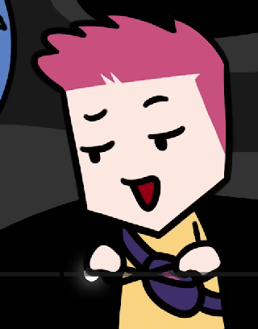
- **Emotion:** mischievous delight.
- **Body / expression:** eyes closed laugh, twiddling fingers, sparkle.
- **Use when:** "heh heh", devious-but-playful beat.

### villain_scheming_angry_smile
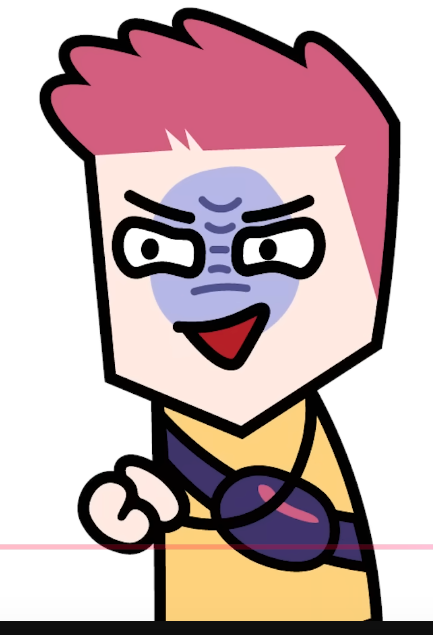
- **Emotion:** menacing, villainous.
- **Body / expression:** purple-shadowed face, furious brows, sly open grin, clenched fist.
- **Use when:** personifying the "evil corporation / algorithm / scammer" — the antagonist of the explainer.

---

## 4. Deadpan / skeptical / pondering

### deadpan_unimpressed_half_lidded
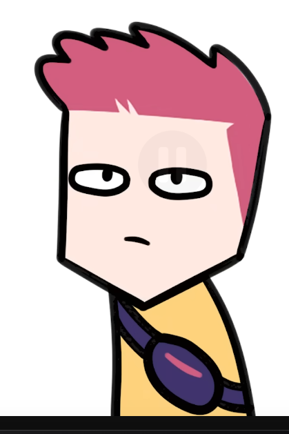
- **Emotion:** deadpan, unimpressed.
- **Body / expression:** half-closed eyes, flat straight mouth.
- **Use when:** the dry-sarcasm anchor — "…great.", reacting flatly to nonsense. This is the channel's signature deadpan.

### deadpan_bored_scratching_head
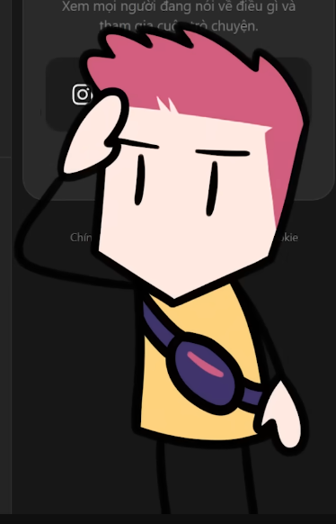
- **Emotion:** bored, done.
- **Body / expression:** half-lidded flat face, scratching head, dark bg.
- **Use when:** "anyway…", boredom, unimpressed scrolling.

### skeptical_side_eye_doubtful
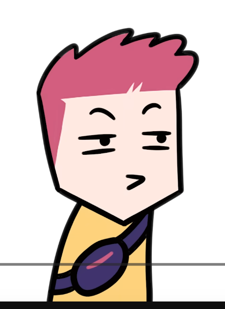
- **Emotion:** doubtful, side-eye.
- **Body / expression:** half-lidded eyes looking aside, small frown, head tilt.
- **Use when:** "I doubt that", quietly calling BS.

### mildly_surprised_hand_at_chin
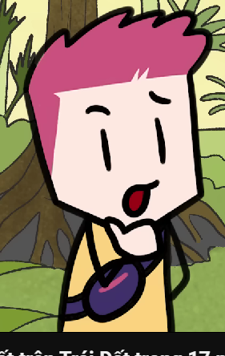
- **Emotion:** mildly surprised / skeptically impressed.
- **Body / expression:** small surprised "o", hand at chin.
- **Use when:** "huh, interesting" (with a hint of doubt).

### pondering_skeptical_hand_on_chin
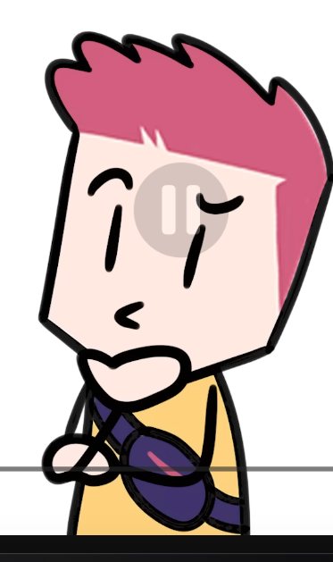
- **Emotion:** pondering with doubt.
- **Body / expression:** eyebrows up, small frown, hand on chin.
- **Use when:** weighing a claim — "hmm, but does that add up?".

### hand_on_cheek_surprised_curious
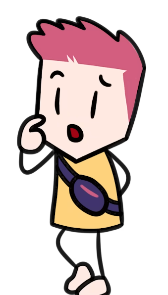
- **Emotion:** curious surprise.
- **Body / expression:** hand on cheek, "o" mouth, raised eyebrow.
- **Use when:** "wait, really?", intrigued reaction.

### hand_on_cheek_pondering_eyes_closed
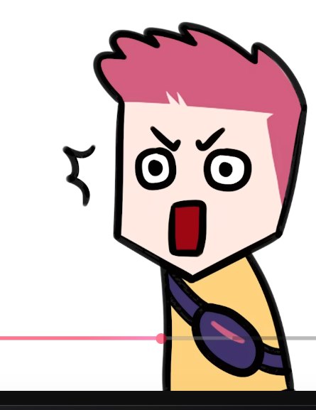
- **Emotion:** pondering, imagining.
- **Body / expression:** hand on cheek, "o" mouth, eyes closed.
- **Use when:** considering a hypothetical — "imagine if…".

---

## 5. Shock / panic / anger / direct call-out

### shocked_panicked_at_laptop
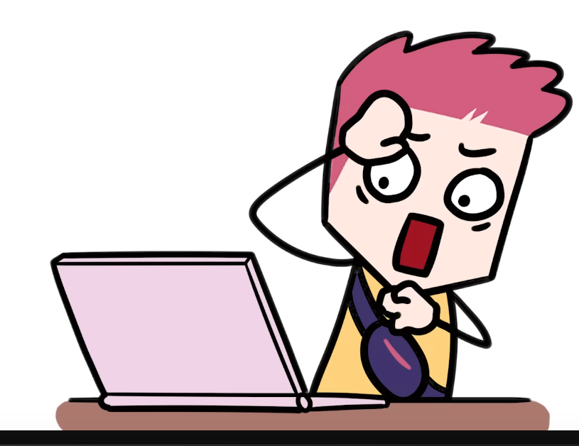
- **Emotion:** alarmed at a screen.
- **Body / expression:** at laptop, hand to neck, wide eyes, open mouth.
- **Use when:** "wait, WHAT" while reading something online; bad news on screen.

### shocked_reading_phone_wide_eyes
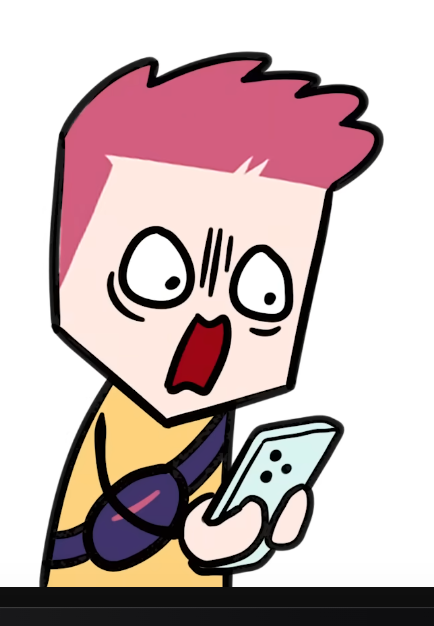
- **Emotion:** shocked at phone.
- **Body / expression:** holding phone, wide eyes, open mouth.
- **Use when:** a shocking notification / bill / message on the phone.

### shocked_sweating_dismayed
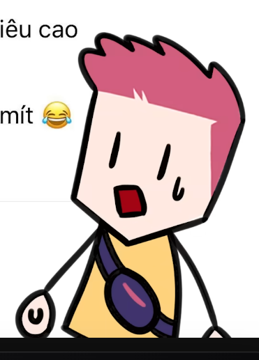
- **Emotion:** dismayed, "oh no".
- **Body / expression:** wide eyes, open square mouth, sweat drop.
- **Use when:** realizing a problem — "and that's when it gets worse".

### panic_hands_on_cheeks_scream
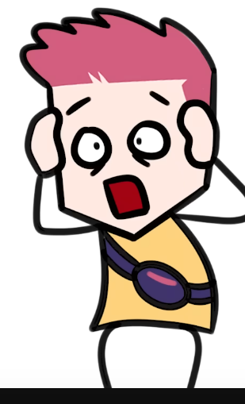
- **Emotion:** full panic.
- **Body / expression:** both hands on cheeks (Home-Alone scream), wide eyes, open mouth.
- **Use when:** peak panic — a huge price reveal, worst-case scenario, "AAAH".

### furious_shouting_anger_mark
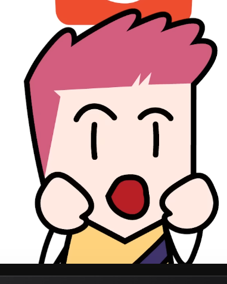
- **Emotion:** rage.
- **Body / expression:** furious brows, wide eyes, open square mouth, anger mark.
- **Use when:** an angry rant beat — "are you KIDDING me", outrage at a fee.

### angry_shouting_at_laptop
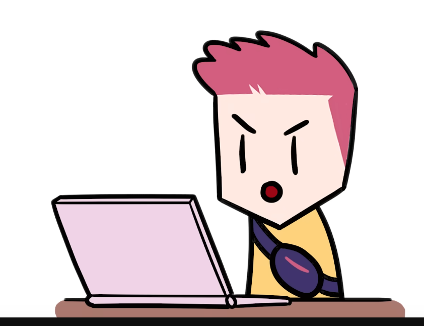
- **Emotion:** frustrated at a screen.
- **Body / expression:** at laptop, angry brows, "o" mouth.
- **Use when:** arguing/fighting a website — "why won't this let me cancel".

### manic_gleeful_googly_eyes
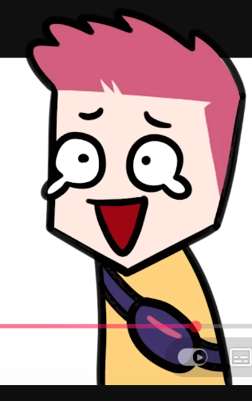
- **Emotion:** manic, unhinged glee.
- **Body / expression:** wide googly eyes, big open laugh.
- **Use when:** comedic mania — "I've completely lost it", absurd overexcitement.

### emphatic_thumbs_up_angry_talking
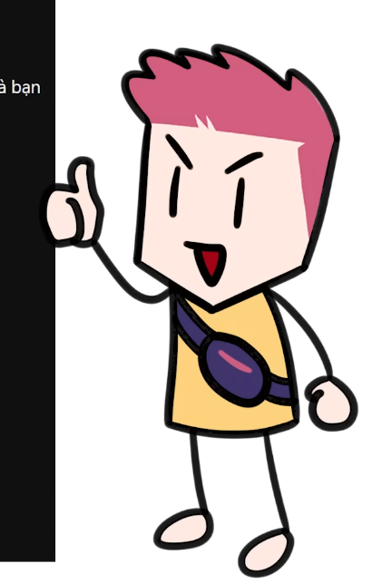
- **Emotion:** aggressive insistence / forced approval.
- **Body / expression:** thumbs up + angry brows + open mouth.
- **Use when:** "do it. DO IT.", mock-forceful advice.

### pointing_at_viewer_serious_accusing
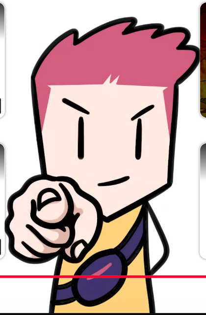
- **Emotion:** direct, accusing.
- **Body / expression:** pointing at the camera, serious/furious brows, flat mouth.
- **Use when:** direct address — "yes, YOU", "and you fell for it too".

---

## 6. Worry / sad / tired / confused

### worried_hands_clasped_anxious
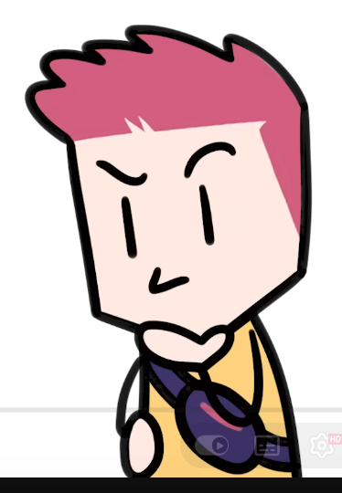
- **Emotion:** anxious.
- **Body / expression:** raised brows, hands clasped at chest, frown.
- **Use when:** nervous "uh oh", worry about a decision.

### worried_uneasy_wide_eyes
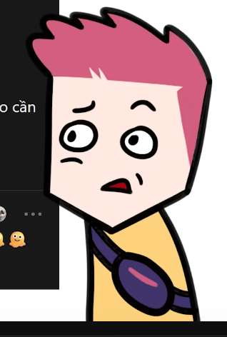
- **Emotion:** uneasy, apprehensive.
- **Body / expression:** raised brows, wide eyes, small open frown.
- **Use when:** "this doesn't feel right", growing dread.

### embarrassed_scratching_head_sweat
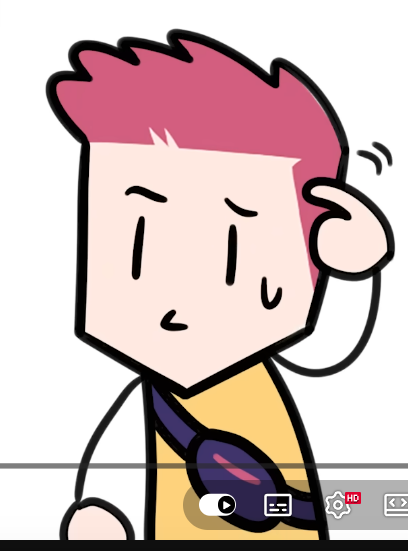
- **Emotion:** sheepish, embarrassed.
- **Body / expression:** scratching head, sweat drop, awkward frown.
- **Use when:** awkward admission — "yeah… that was me", "guilty".

### cringe_uneasy_drool
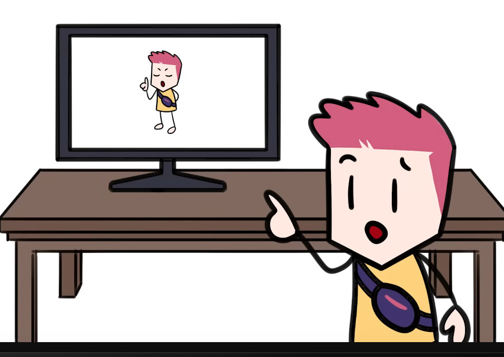
- **Emotion:** cringe, secondhand embarrassment.
- **Body / expression:** eyes down, drool/snot, awkward face.
- **Use when:** reacting to cringe content — "oof, that's rough".

### annoyed_disgusted_open_frown
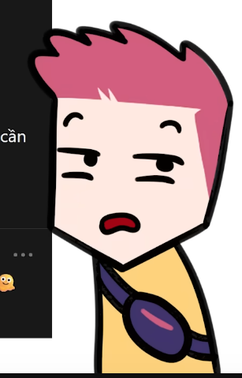
- **Emotion:** disgust, annoyance.
- **Body / expression:** half-lidded eyes, open downturned frown.
- **Use when:** "ew", distaste, "ugh, really?".

### exhausted_dead_inside_eye_bags
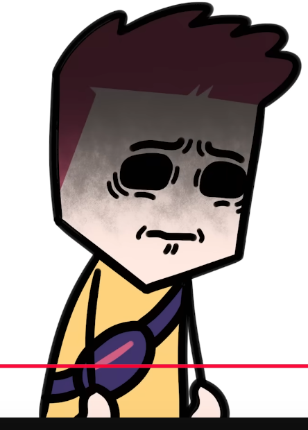
- **Emotion:** burnt out, dead inside.
- **Body / expression:** dark eye bags, gray gradient face, frown.
- **Use when:** "modern life", chronic exhaustion, relatable burnout beat.

### exhausted_sleepy_at_desktop
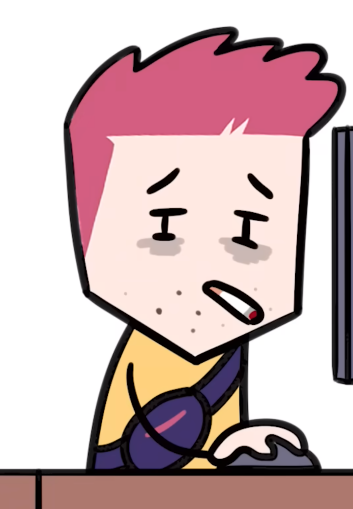
- **Emotion:** tired at work.
- **Body / expression:** at desk, sleepy half-lidded eyes, blush, slumped.
- **Use when:** overwork, late-night grind — "another all-nighter".

### sleepy_yawning_open_mouth
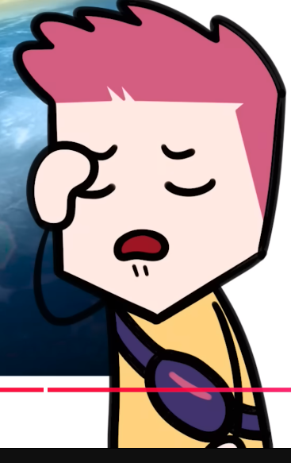
- **Emotion:** sleepy / bored.
- **Body / expression:** eyes closed, yawning open mouth.
- **Use when:** "boring", tedium, "wake me up when it's over".

### holding_need_a_job_sign_sad
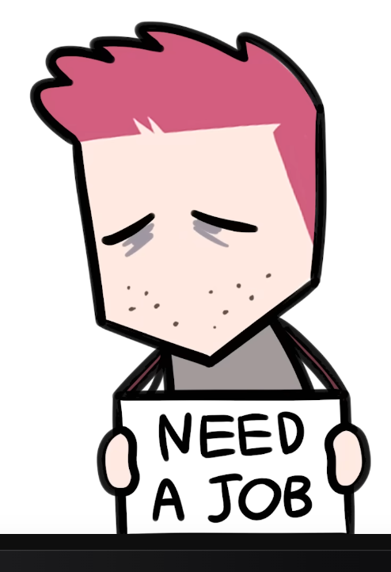
- **Emotion:** desperate, broke.
- **Body / expression:** sad droopy eyes, holding a "NEED A JOB" sign.
- **Use when:** unemployment, being broke, job-hunt gag.

### lying_down_fainted_dead
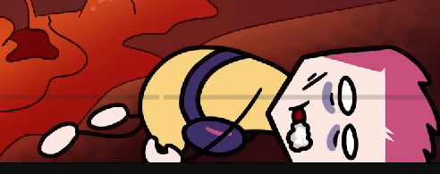
- **Emotion:** defeated / "dead".
- **Body / expression:** lying on the floor, X eyes, tongue out.
- **Use when:** "I'm done", total defeat, "this killed me", overwhelmed payoff.

### shrug_both_hands_up_smile
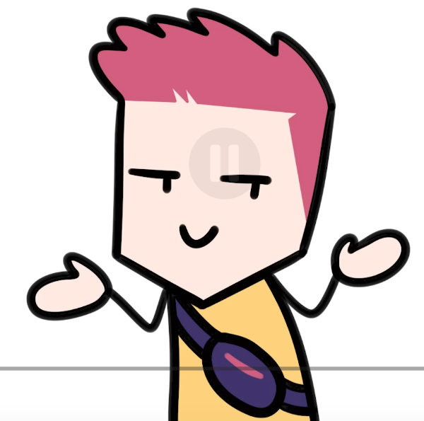
- **Emotion:** nonchalant, "who knows".
- **Body / expression:** both hands up shrug, relaxed smile.
- **Use when:** "whatever", "your guess is as good as mine".

### shrug_confused_flat_mouth
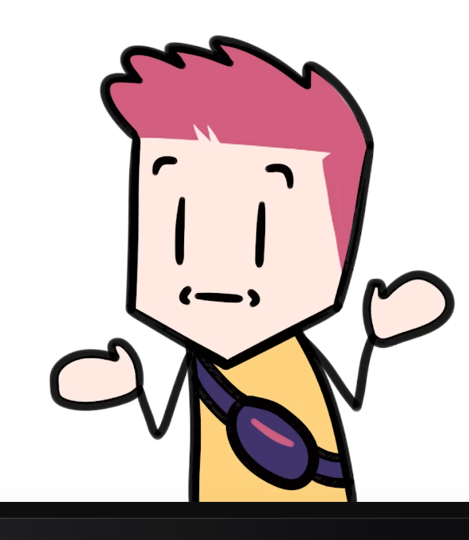
- **Emotion:** genuinely confused.
- **Body / expression:** both hands up shrug, blank eyes, flat mouth.
- **Use when:** "I have absolutely no idea", blank confusion.

---

## 7. Props / role costumes

Use these only when the line names the role or object — they read as "WIT plays the X".

### using_laptop_calm_smile
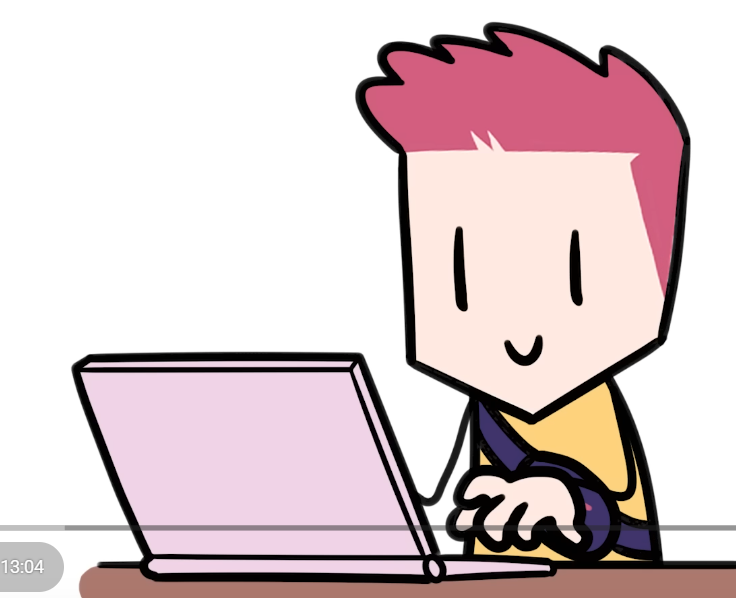
- **Role/prop:** laptop, calm.
- **Use when:** browsing/working calmly — "so I looked it up", casual research.

### sitting_at_desktop_monitor_deadpan
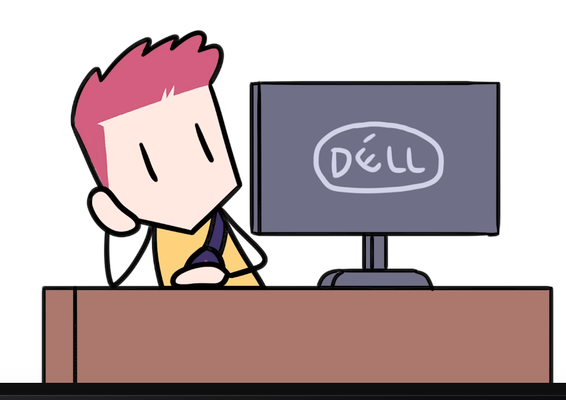
- **Role/prop:** desktop (Dell) monitor, deadpan.
- **Use when:** office worker / "9 to 5", staring blankly at a work screen.

### sitting_at_desktop_monitor_using_mouse
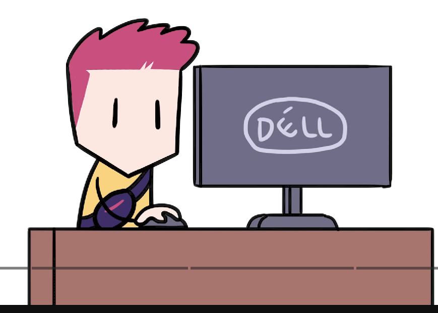
- **Role/prop:** desktop monitor, calm, hand on mouse.
- **Use when:** clicking through something at a desk; office context, neutral.

### holding_phone_looking_content
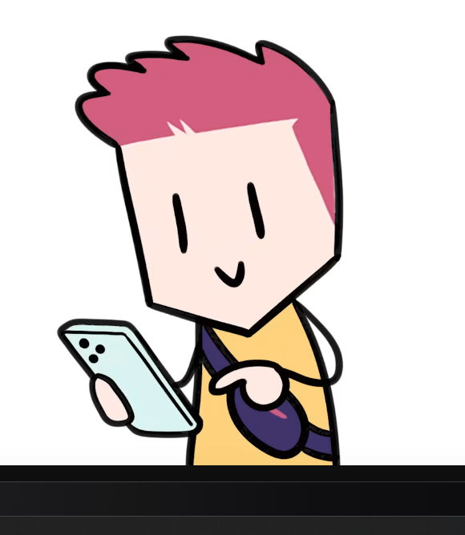
- **Role/prop:** phone, content.
- **Use when:** scrolling on the phone — "on your phone", casual use.

### holding_phone_happy_talking_blush
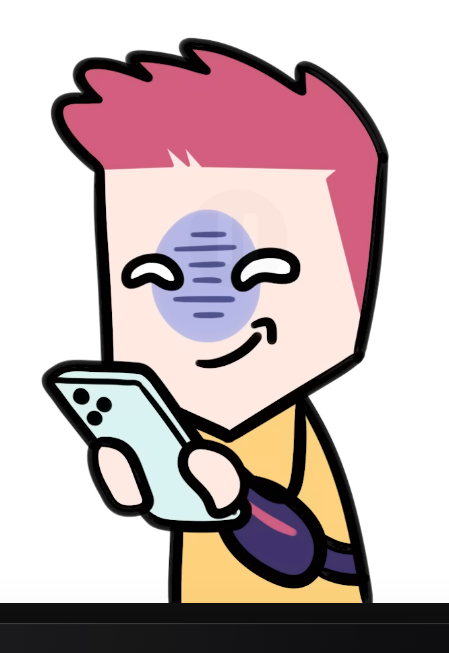
- **Role/prop:** phone, happy + blush.
- **Use when:** happily texting/posting — "sharing it online", dopamine-from-phone beat.

### reading_book_round_glasses_studious
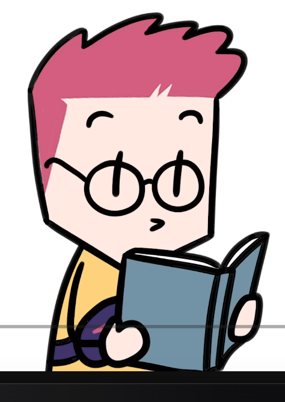
- **Role/prop:** round glasses + book, studious.
- **Use when:** "the experts say", studying, the learning/intellectual beat (great fit for the English-learner angle).

### dealing_cards_at_table_serious
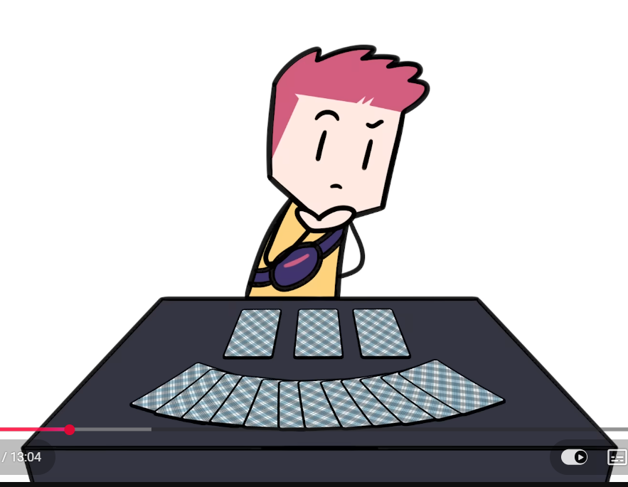
- **Role/prop:** dealing cards at a table, serious.
- **Use when:** odds/gambling, "the house always wins", risk and strategy.

### boss_suit_sunglasses_sparkle
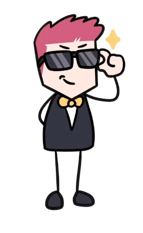
- **Role/prop:** suit + bowtie + sunglasses, sparkle, smug.
- **Use when:** personifying a CEO/company — "meanwhile, the company…", flexing wealth.

### rich_flex_gold_chain_sunglasses
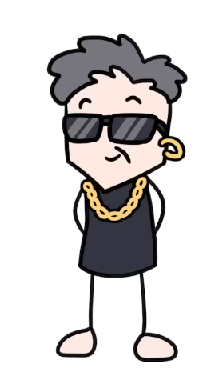
- **Role/prop:** gray hair + gold chain + sunglasses + tank top.
- **Use when:** the flex / the guru / influencer caricature — "trust me, I'm rich".

### gamer_streamer_headset_with_gun
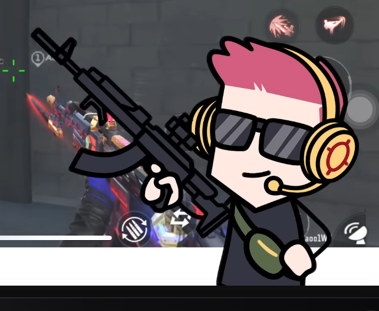
- **Role/prop:** sunglasses + headset + gun, game UI bg.
- **Use when:** gaming/streaming topic — "the streamer", a game reference, sponsor segue.

### doctor_coat_stethoscope_listening
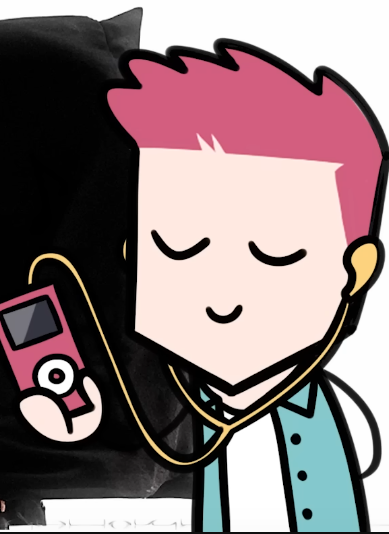
- **Role/prop:** coat + stethoscope, calm listening.
- **Use when:** "let's diagnose the problem", health metaphor, expert check-up.

### swimming_underwater_goggles_cap
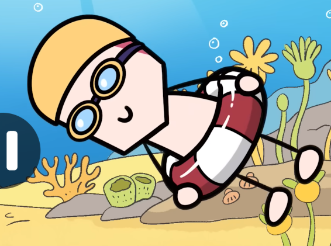
- **Role/prop:** swim cap + goggles, underwater.
- **Use when:** "drowning in debt / work / emails", being underwater, an escape/vacation gag.

### wearing_gas_mask_apocalypse
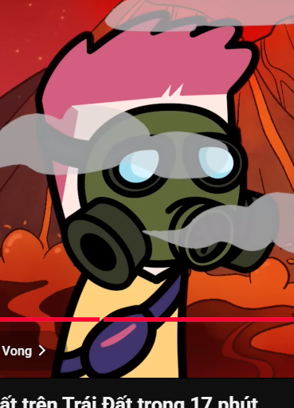
- **Role/prop:** gas mask, smoky red apocalypse bg.
- **Use when:** "toxic environment", disaster framing, "it's a warzone out there".
